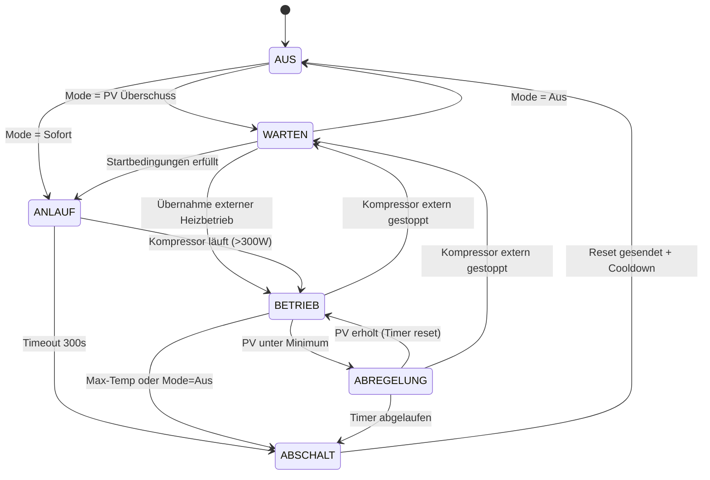

# PV Wärmepumpen Steuerung

[](https://opensource.org/licenses/MIT)
[]()
[](https://www.home-assistant.io/)

Dieses Home Assistant Add-on steuert eine **Alpha Innotec Wärmepumpe** (Luxtronik 2.1) über **Modbus TCP** zur Optimierung des PV-Eigenverbrauchs. Bei Solarüberschuss wird der Kombispeicher über den Heizbetrieb geladen – vollautomatisch, intelligent und sicher.

Dank MQTT Auto-Discovery werden alle Sensoren und Steuerelemente in Home Assistant automatisch als Gerät angelegt – kein manuelles YAML nötig!

---

## ⚠️ Haftungsausschluss

Diese Software steuert eine Wärmepumpe über Modbus TCP. Unsachgemässe Konfiguration kann zu Schäden an der Anlage führen. Die Nutzung erfolgt auf eigene Verantwortung. Der Autor übernimmt keinerlei Haftung für Schäden, die durch die Nutzung dieser Software entstehen. Vor der Inbetriebnahme sind die Sicherheitseinstellungen der Wärmepumpe (Hochdruck, Übertemperatur, Schaltspielschutz, usw.) zu prüfen.

---

## 🌟 Features

- **Vollautomatische PV-Überschusssteuerung:** Startet die WP bei Solarüberschuss und stoppt bei Bewölkung mit konfigurierbarer Verzögerung
- **Intelligente Leistungssteuerung:** Soft Limit wird dem PV-Überschuss nachgeführt
- **Kompressor-Überwachung:** Erkennt externe Starts/Stopps (Warmwasser, Abtauen, EVU-Sperre)
- **Übernahme-Logik:** Übernimmt laufenden Heizbetrieb wenn genug PV vorhanden
- **Sicherheitsmechanismen:** Notaus bei Übertemperatur, Schaltspielschutz, Modbus-Timeout
- **Drei Betriebsmodi:** Aus, PV Überschuss, Sofort
- **Alle Parameter live anpassbar:** Über das HA Dashboard ohne Neustart
- **Autonomer Docker-Container:** Läuft unabhängig von HA Core

---

## 📐 Systemarchitektur

Das Add-on läuft als eigenständiger Docker-Container innerhalb von Home Assistant OS und kommuniziert über drei Kanäle:

| Kanal | Richtung | Zweck |
|---|---|---|
| **HA REST API** | Add-on ← HA | PV-Überschuss Entity lesen |
| **MQTT** | Add-on ↔ HA | Entities publizieren + Parameter empfangen |
| **Modbus TCP** | Add-on → WP | Register lesen und schreiben |

### Komponenten

| Komponente | Aufgabe |
|---|---|
| main.py | Hauptloop, Orchestrierung, Timing |
| state_machine.py | Zustandsmaschine (Kernlogik) |
| modbus_client.py | Modbus TCP Lesen/Schreiben |
| mqtt_handler.py | MQTT Discovery + Publish + Subscribe |
| ha_client.py | HA REST API (PV Surplus lesen) |
| safety.py | Sicherheitslogik (NOTAUS) |
| config.py | Konfiguration + Versionierung |
| logger.py | Logging Setup |

### Datenfluss

1. Alle **15 Sekunden**: PV-Überschuss aus HA lesen, Modbus-Register lesen, State Machine evaluieren, Status via MQTT publishen
2. Alle **60 Sekunden**: Modbus-Register schreiben (Fixwert + Limit), gegen 15-Min-Timeout der WP

---

## 🔄 Funktionsweise

### Grundprinzip

Die Steuerung nutzt das **Smart Home Interface (SHI)** der Luxtronik 2.1 über Modbus TCP:

1. **Fixwert-Modus (HR10000=1):** Der Rücklauf-Sollwert wird direkt vorgegeben
2. **Soft Limit (HR10040=1):** Die elektrische Leistungsaufnahme wird begrenzt
3. **Register-Refresh:** Alle 60 Sekunden werden die Register neu geschrieben (gegen 15-Min-Timeout)

### Fixwert-Berechnung

| Phase | Fixwert | Zweck |
|---|---|---|
| **ANLAUF** | max_temperature (z.B. 55°C) | Grosses Delta für sicheren Kompressorstart |
| **BETRIEB** | min(RL_extern + Offset, max_temperature) | Dynamisch nachgeführt |

### Limit-Berechnung (BETRIEB und ABREGELUNG)

Aktives Limit = max(PV_Überschuss, min_power)

| PV Überschuss | min_power | Ergebnis |
|---|---|---|
| 1500W | 600W | Limit = 1500W |
| 800W | 600W | Limit = 800W |
| 400W | 600W | Limit = 600W (Minimum greift) |

---

## 🔀 Zustandsmaschine (State Machine)

Das Herzstück der Steuerung ist eine Zustandsmaschine mit 6 Zuständen:



### Zustände im Detail

| Zustand | Beschreibung | Modbus-Aktion |
|---|---|---|
| **AUS** | Steuerung inaktiv, nur Monitoring | Nur lesen (alle 15s) |
| **WARTEN** | Mode aktiv, Startbedingungen werden geprüft | Nur lesen (alle 15s) |
| **ANLAUF** | Fixwert = max_temp gesetzt, warte auf Kompressorstart | Schreiben: Fixwert ohne Limit (60s) |
| **BETRIEB** | Kompressor läuft, Fixwert + Limit aktiv | Schreiben: Fixwert + Limit (60s) |
| **ABREGELUNG** | PV zu tief, Timer läuft, Limit = min_power | Schreiben: Fixwert + Limit (60s) |
| **ABSCHALT** | Reset senden, Cooldown starten | Schreiben: Reset (einmalig) |

### Startbedingungen (WARTEN → ANLAUF)

Alle folgenden Bedingungen müssen gleichzeitig erfüllt sein:

| # | Bedingung | Prüfung |
|---|---|---|
| 1 | PV-Überschuss ausreichend | pv_surplus >= min_surplus |
| 2 | PV-Überschuss stabil | PV >= min_surplus seit min_start_duration |
| 3 | Batterie-SOC ausreichend | battery_soc >= min_battery_soc (0% = deaktiviert) |
| 4 | Schaltspielsperre abgelaufen | cooldown = 0 |
| 5 | Speicher nicht voll | rl_extern < max_temperature |
| 6 | Genug Spielraum | max_temperature - rl_extern >= offset |
| 7 | Kompressor frei | Nicht extern belegt (WW, Abtauen) |
| 8 | Keine EVU-Sperre / Abtauen | Betriebsart ≠ 3 und ≠ 4 |
| 9 | Modbus verbunden | Verbindung steht |

Wenn Bedingung 4 nicht erfüllt ist (z.B. RL_ext=52°C, max=55°C, Offset=5K, Delta=3K < 5K), wird **nicht gestartet** und eine entsprechende Meldung geloggt.

### Zustandsübergänge

| Von | Nach | Bedingung | Aktion |
|---|---|---|---|
| AUS | WARTEN | Mode = "PV Überschuss" | – |
| AUS | ANLAUF | Mode = "Sofort" + Cooldown=0 + RL_ext < max | – |
| WARTEN | ANLAUF | Alle Startbedingungen erfüllt | Timer starten |
| WARTEN | BETRIEB | WP heizt extern + unser Limit >= Leistung | Übernahme! |
| ANLAUF | BETRIEB | Leistung > 300W | Kompressor läuft |
| ANLAUF | ABSCHALT | Timeout 300s | Fehler loggen |
| BETRIEB | ABREGELUNG | PV < min_surplus | Abschalt-Timer starten |
| BETRIEB | ABSCHALT | RL_ext >= max_temp ODER Mode="Aus" | – |
| ABREGELUNG | BETRIEB | PV >= min_surplus | Timer reset |
| ABREGELUNG | ABSCHALT | Timer abgelaufen | – |
| BETRIEB/ABREGELUNG | WARTEN | Kompressor extern gestoppt | Reset + Cooldown starten |
| Jeder aktive | ABSCHALT | SAFETY Verletzung | Sofort! |

---

## 🛡️ Sicherheitsmechanismen

| Schutz | Bedingung | Aktion | Konfigurierbar |
|---|---|---|---|
| **NOTAUS** | RL extern >= max_absolute_temperature UND aktive Steuerung | CRITICAL + Sofort ABSCHALT | max_absolute_temperature (65°C) |
| **Überhitzungs-Warnung** | RL extern >= max_absolute_temperature OHNE aktive Steuerung | WARNING + kein Start möglich | max_absolute_temperature (65°C) |
| **Max Temperatur** | RL_extern >= max_temperature | ABSCHALT | Dashboard Slider |
| **Schaltspielschutz** | Cooldown aktiv | Kein Start möglich | min_standzeit |
| **Progressiver Cooldown** | Nach Fehlstart(s) | Cooldown × 2 (max × 3) | Automatisch |
| **EVU-Sperre Erkennung** | Betriebsart = 3 | Kein Start möglich | Automatisch |
| **Start-Hysterese** | PV muss X Min stabil über Schwelle | Kein Sofort-Start bei Spikes | min_start_duration |
| **Min. Batteriestand** | SOC unter Schwelle | Kein Start | min_battery_soc |
| **Anlauf-Timeout** | 300s ohne Kompressorstart | ABSCHALT + ERROR Log | startup_no_limit_s |
| **Reset-Verifizierung** | Kompressor läuft 120s nach Reset noch | WARNING Log | Automatisch |
| **Register-Timeout** | Refresh alle 60s | WP fällt nach 15 Min auf Default | modbus_refresh_s |
| **Modbus-Disconnect** | Verbindung verloren | Retry alle 30s | modbus_retry_delay_s |
| **HA-Disconnect** | Kein PV-Wert seit 5 Min | Letzte Werte, dann ABSCHALT | ha_connection_timeout_min |
| **Delta-Prüfung** | max_temp - RL_ext < Offset | Kein Start | Automatisch |

### Schaltspielschutz

Cooldown = max(wp_min_standzeit_min, pvwp_min_standzeit) × Multiplikator

- wp_min_standzeit_min: Technisches Hardlimit (Add-on Config, Standard: 20 Min)
- pvwp_min_standzeit: User-Einstellung (Dashboard Slider, Standard: 25 Min)
- Multiplikator: 1 (normal), 2 (nach 1 Fehlstart), 3 (nach 2+ Fehlstarts)

Der User kann die technische Grenze **nie unterschreiten**. Bei erfolgreichen Starts wird der Multiplikator zurückgesetzt.

| Situation | Cooldown (bei min_standzeit=25) |
|---|---|
| Normaler Stopp | 25 Min |
| Nach 1 Fehlstart | 50 Min |
| Nach 2+ Fehlstarts | 75 Min |

---

## 🔍 Kompressor-Überwachung

Das Add-on überwacht permanent den tatsächlichen Zustand des Kompressors (Leistung > 300W = läuft) und reagiert auf externe Ereignisse.

### Externer Stopp (während BETRIEB/ABREGELUNG)

| Mögliche Ursache | Reaktion |
|---|---|
| RL-Begrenzung der Luxtronik (50°C) | → **Reset** + WARTEN + Cooldown |
| Warmwasser-Anforderung beendet | → **Reset** + WARTEN + Cooldown |
| EVU-Sperre | → **Reset** + WARTEN + Cooldown |
| Hochdruckstörung | → **Reset** + WARTEN + Cooldown |

**Wichtig:** Bei jedem Verlassen des aktiven Zustands (ANLAUF/BETRIEB/ABREGELUNG) werden die Modbus-Register **immer** zurückgesetzt – unabhängig vom Grund. Nach Reset wird verifiziert, dass der Kompressor innerhalb von 120s stoppt (WARNING falls nicht).

### Externer Start (während WARTEN)

| WP-Modus | Unser PV | Reaktion |
|---|---|---|
| Warmwasser (Betriebsart=1) | egal | WARTEN (nicht stören!) |
| Heizen + unser Limit >= Leistung | genug PV | ÜBERNEHMEN → direkt BETRIEB |
| Heizen + unser Limit < Leistung | zu wenig PV | WARTEN (würden drosseln) |
| Abtauen / EVU-Sperre | egal | WARTEN |

### Externe Übersteuerung (während BETRIEB)

| Ereignis | Log-Level | Aktion |
|---|---|---|
| WP wechselt auf Warmwasser | WARNING | Beobachten, weiter steuern |
| WP wechselt auf Abtauen | WARNING | Beobachten |
| WP kehrt zum Heizen zurück | INFO | Normal weiter steuern |
| Kompressor stoppt | WARNING | → WARTEN + Cooldown |

---

## 🎛️ Betriebsmodi

| Modus | Verhalten | Anwendungsfall |
|---|---|---|
| **Aus** | Steuerung inaktiv. Kein Modbus-Schreiben. Nur Monitoring. | Normaler WP-Betrieb ohne PV |
| **PV Überschuss** | Vollautomatisch: Start bei PV, Stopp nach Verzögerung. | Standard-PV-Betrieb |
| **Sofort** | WP sofort starten mit max. Leistung. Max-Temp gilt weiterhin. | Manueller Test, schnell laden |

---

## ⚙️ Konfiguration

### Add-on Konfiguration (selten geändert)

| Bezeichnung | Option | Typ | Beschreibung | Standard |
|---|---|---|---|---|
| MQTT Broker Adresse | mqtt_host | String | IP oder Hostname des MQTT Brokers | core-mosquitto |
| MQTT Port | mqtt_port | Integer | Port des MQTT Brokers | 1883 |
| MQTT Benutzername | mqtt_user | String | Benutzername für MQTT Authentifizierung | – |
| MQTT Passwort | mqtt_password | String | Passwort für MQTT Authentifizierung | – |
| Wärmepumpe IP-Adresse | wp_ip | String | IP-Adresse der Luxtronik Steuerung | 192.168.0.175 |
| Wärmepumpe Modbus Port | wp_port | Integer | Modbus TCP Port | 502 |
| Modbus Slave ID | wp_slave_id | Integer | Slave ID der Wärmepumpe | 1 |
| PV-Überschuss Entity | ha_entity_pv_surplus | String | HA Entity-ID die den PV-Überschuss in Watt liefert | sensor.solar_surplus_power |
| Batterie SOC Entity | ha_entity_battery_soc | String | HA Entity-ID für Batterie-Ladestand in % (leer = deaktiviert) | sensor.battery_state_of_capacity |
| Modbus Schreibintervall | modbus_refresh_s | Integer | Wie oft Register geschrieben werden (s) | 60 |
| Messintervall | measurement_interval_s | Integer | Wie oft Sensoren gelesen werden (s) | 15 |
| Anlauf-Timeout | startup_no_limit_s | Integer | Max. Wartezeit auf Kompressorstart (s) | 300 |
| Technische Mindest-Standzeit | wp_min_standzeit_min | Integer | Minimale Pause zwischen Kompressorstarts (min) | 20 |
| Modbus Retry Verzögerung | modbus_retry_delay_s | Integer | Wartezeit vor erneutem Verbindungsversuch (s) | 30 |
| HA Verbindungs-Timeout | ha_connection_timeout_min | Integer | Max. Dauer ohne HA-Daten bevor Abschaltung (min) | 5 |
| NOTAUS Temperatur | max_absolute_temperature | Float | Absolute Maximaltemperatur für Notabschaltung (°C) | 60.0 |
| MQTT Topic Prefix | mqtt_topic_prefix | String | Prefix für alle MQTT Topics | pvwp |
| MQTT Discovery Prefix | mqtt_discovery_prefix | String | Prefix für HA Auto-Discovery | homeassistant |
| Log-Level | log_level | Dropdown | Detailgrad der Protokollierung | info |

### Dashboard Parameter (live anpassbar)

| Parameter | Bereich | Standard | Einheit | Beschreibung |
|---|---|---|---|---|
| **Betriebsmodus** | Aus / PV Überschuss / Sofort | Aus | – | Hauptschalter |
| **Offset** | 3.0 – 20.0 | 5.0 | K | Aufschlag auf RL extern |
| **Min. PV Überschuss** | 500 – 5000 | 800 | W | Startschwelle |
| **Min. Überschuss-Dauer** | 1 – 15 | 10 | min | PV muss X Min stabil über Schwelle sein |
| **Min. Batteriestand** | 0 – 100 | 0 | % | Batterie-SOC unter dem nicht gestartet wird (0 = deaktiviert) |
| **Ausschaltverzögerung** | 5 – 60 | 30 | min | Wartezeit bei PV-Mangel |
| **Min. Standzeit** | 5 – 60 | 25 | min | Pause zwischen Einschaltungen |
| **Max. Speichertemperatur** | 40.0 – 60.0 | 55.0 | °C | Obere Grenze |
| **Min. Leistung** | 500 – 2000 | 600 | W | Untere Limit-Grenze |

#### Parameter-Persistenz

Dashboard-Einstellungen werden automatisch in `/data/params.json` gespeichert und überleben:
- Add-on Neustarts
- Rebuilds / Updates
- HA Neustarts

Die Datei wird nur gelöscht wenn das Add-on explizit mit "Daten löschen" deinstalliert wird. Bei Erstinstallation gelten die Default-Werte.

**Inhalt `/data/params.json`:**

```json
{
  "mode": "PV Überschuss",
  "offset": 5.0,
  "min_surplus": 800,
  "shutdown_delay": 30,
  "min_standzeit": 25,
  "max_temperature": 50.0,
  "min_power": 600,
  "min_start_duration": 10,
  "min_battery_soc": 25
}

---

## 📊 Entities (automatisch erzeugt via MQTT Discovery)

### Sensoren (Read-Only)

| Entity | Einheit | Beschreibung |
|---|---|---|
| Zustand | – | AUS, WARTEN, ANLAUF, BETRIEB, ABREGELUNG, ABSCHALT |
| Leistungsaufnahme | W | Elektrische Aufnahme des Kompressors |
| Heizleistung | W | Thermische Leistung |
| COP | – | Coefficient of Performance |
| Speichertemperatur | °C | RL extern (Kombispeicher-Fühler) |
| Sollwert | °C | An die WP gesendeter Fixwert |
| PV Überschuss | W | Von HA gelesener PV-Überschuss |
| Aktives Limit | W | Gesetztes Soft Limit |
| Laufzeit | min | Zeit seit Kompressorstart |
| Standzeit | min | Verbleibende Schaltspielsperre |
| Abschalt-Timer | min | Verbleibende Ausschaltverzögerung |
| Energie heute | kWh | Heutige Energie (Reset Mitternacht) |
| Batteriestand | % | Batterie State of Charge (wenn konfiguriert) |

### Binärsensoren

| Entity | Beschreibung |
|---|---|
| WP Kompressor | ON = Kompressor läuft (>300W) |
| Modbus Verbindung | ON = Modbus TCP verbunden |

### Steuerelemente

| Entity | Typ | Beschreibung |
|---|---|---|
| Betriebsmodus | Select | Aus / PV Überschuss / Sofort |
| Offset | Number (Slider) | Temperatur-Offset in Kelvin |
| Min. PV Überschuss | Number (Slider) | Startschwelle in Watt |
| Ausschaltverzögerung | Number (Slider) | Timer in Minuten |
| Min. Standzeit | Number (Slider) | Cooldown in Minuten |
| Max. Speichertemperatur | Number (Slider) | Obere Grenze in °C |
| Min. Leistung | Number (Slider) | Untere Limit-Grenze in Watt |
| Min. Überschuss-Dauer | Number (Slider) | PV-Stabilisierungszeit in Minuten |
| Min. Batteriestand | Number (Slider) | Min. Batterie-SOC in % (0 = deaktiviert) |

---

## 📡 Modbus Register

### Geschriebene Register (Holding Registers)

| Register | Wert | Zweck |
|---|---|---|
| HR10065 | 0 | Overall Mode: Individuell |
| HR10000 | 1 | Modus Heizen: Fixwert |
| HR10001 | Fixwert x 10 | Rücklauf-Sollwert (z.B. 500 = 50.0°C) |
| HR10040 | 1 | LPC Modus: Soft Limit |
| HR10041 | Limit / 100 | PC Limit (z.B. 12 = 1200W) |

### Gelesene Register (Input Registers)

| Register | Wert | Zweck |
|---|---|---|
| IR10102 | °C x 10 | RL extern (Speicherfühler) |
| IR10101 | °C x 10 | RL SOLL (aktuell gültig) |
| IR10100 | °C x 10 | RL IST |
| IR10105 | °C x 10 | Vorlauf IST |
| IR10301 | kW x 10 | Leistungsaufnahme |
| IR10300 | kW x 10 | Heizleistung |
| IR10002 | 0-7 | Betriebsart (0=Heizen, 1=WW, 4=Abtauen, 5=Keine) |
| IR10000 | Bitfeld | WP Status (Bit 0 = Kompressor) |

### Betriebsparameter & Hinweise

Die folgenden Parameter basieren auf Herstellerangaben sowie eigenen Erkenntnissen aus der Integration.

#### Herstellervorgaben

| Thema | Detail | Quelle |
|---|---|---|
| Anlaufleistung & Soft Limit | Der Verdichter startet nicht, wenn die benötigte Anlaufleistung über dem eingestellten Soft Limit (HR10041) liegt. **Abhilfe:** Entweder HR10041 höher setzen, um die Anlaufleistung abzudecken, oder erst starten und das Limit anschliessend nachsetzen. | Hersteller (Mail) |
| Rücklauf-/Vorlaufbegrenzung | Konfigurierbar über Bedienteil: *Service → Einstellungen → Temperaturen* (Installateurenzugang erforderlich). Werkseinstellung: 50°C. Erhöhung auf 55–60°C vom Hersteller freigegeben. Max. Vorlauf ca. 70°C (wird je nach Bedingungen dynamisch nach unten angepasst). Max. Rücklauf liegt ca. 4–8°C unter dem Vorlauf. ⚠️ Höhere Temperaturen bedeuten höhere Belastung der WP. | Hersteller (Mail) |
| Mindestleistung Kompressor | Die minimale Leistung ist abhängig von Wärmequelle und Vorlauftemperatur. Siehe Leistungskurve Pe min/max in der Bedienungsanleitung. | Bedienungsanleitung, Anhang S. 21 |
| Register-Timeout (15 Min) | Der Modbus-Client setzt alle empfangenen Daten nach 15 Min ohne jegliche Anfrage vom Master auf Standardeinstellung zurück. **Wichtig:** Jede Anfrage (auch Lesezugriffe/Polling) setzt den Timer zurück – solange das System Register liest, bleiben geschriebene Werte erhalten. | Betriebsanleitung SHI Modbus TCP, Kap. 3 |

#### Erkenntnisse aus der Integration

| Thema | Detail |
|---|---|
| Schreibpausen | Zwischen Registerschreibvorgängen mindestens 1 Sekunde warten |
| Startdelta (Workaround) | Für einen zuverlässigen Kompressorstart hat sich in der Praxis ein Delta von ca. 10K (SOLL - RL_ext) bewährt. Dies ist keine Herstellervorgabe, sondern ein empirischer Erfahrungswert. |

---

## ⏱️ Timing

| Aktion | Intervall | Konfiguration |
|---|---|---|
| Modbus lesen | 15s | measurement_interval_s |
| PV-Surplus lesen | 15s | measurement_interval_s |
| State Machine evaluieren | 15s | measurement_interval_s |
| Modbus schreiben (Refresh) | 60s | modbus_refresh_s |
| MQTT Status publishen | 15s | measurement_interval_s |
| Energiezähler reset | Mitternacht | Automatisch |

---

## 🛠️ Voraussetzungen

1. **Wärmepumpe:** Alpha Innotec mit Luxtronik 2.1 (Software V3.89+)
2. **Modbus TCP:** Am Regler aktiviert (Port 502)
3. **Smart Grid:** Am Regler auf **"Nein"** gestellt
4. **Heizgrenze:** Am Regler **deaktiviert** (damit im Sommer gestartet werden kann)
5. **Netzwerk:** WP und HA im gleichen LAN
6. **MQTT:** Mosquitto Add-on in HA installiert und konfiguriert
7. **PV-Sensor:** Ein HA Entity das den PV-Überschuss in Watt liefert
8. **Batterie-Sensor (optional):** Ein HA Entity das den Batterie-SOC in % liefert

---

## 📦 Installation

1. Navigiere in Home Assistant zu **Einstellungen** → **Add-ons**
2. Klicke auf **Add-on Store** (unten rechts)
3. Klicke oben rechts auf die drei Punkte → **Repositories**
4. Füge die Repository-URL hinzu: https://github.com/your-repo/pv-wp-control
5. Schliesse das Fenster und lade die Seite neu
6. Finde **"PV Wärmepumpen Steuerung"** und klicke **Installieren**
7. Tab **Konfiguration**: Werte eintragen (MQTT + WP IP)
8. Aktiviere **"Beim Booten starten"** und **"Watchdog"**
9. Klicke **Starten**
10. Prüfe **Logs** – nach Start erscheinen Entities automatisch

---

## 🐞 Fehlerbehebung

### Log-Level

| Level | Ausgabe | Anwendungsfall |
|---|---|---|
| error | Nur Fehler und kritische Ereignisse | Produktiv (minimal) |
| warning | + Warnungen (externe Stopps, Safety) | Produktiv |
| info | + Zustandswechsel, Start/Stopp, Zyklus-Zusammenfassung | Normalbetrieb |
| debug | + Heartbeat (60 Min), BETRIEB↔ABREGELUNG Wechsel, Fixwert/Limit, Modbus verify, Messzyklen | Nur Fehlersuche! |

### Häufige Probleme

| Problem | Log-Meldung | Lösung |
|---|---|---|
| WP startet nicht | ANLAUF FEHLGESCHLAGEN nach 300s | WP-interne Sperre abwarten, Störung prüfen |
| SOLL nicht übernommen | SOLL nicht übernommen! | Modbus-Verbindung prüfen |
| SOLL bei 50°C gedeckelt | SOLL=50.0 (erwartet ~55.0) | RL-Begrenzung der Luxtronik |
| MQTT rc=5 | Verbindung fehlgeschlagen (rc=5) | User/Passwort prüfen |
| Kompressor extern gestoppt | Kompressor extern gestoppt! | Normal! Cooldown läuft. |
| Kein Start wegen Delta | zu wenig Spielraum | Speicher warm, warten |
| NOTAUS | RL extern >= 60°C | Warten bis abgekühlt |
| EVU-Sperre blockiert Start | EVU-Sperre aktiv | Normal! Warte auf Freigabe (~60-90 Min) |
| Mehrere Fehlstarts | ANLAUF FEHLGESCHLAGEN, Fehlstarts=2 | WP-interne Sperre, Cooldown verlängert sich automatisch |

---

## 📡 MQTT Topics (Referenz)

### Status (Add-on → HA)

| Topic | Beispiel | Beschreibung |
|---|---|---|
| pvwp/state | BETRIEB | Zustand |
| pvwp/power_consumption | 850 | Leistungsaufnahme (W) |
| pvwp/heat_output | 4200 | Heizleistung (W) |
| pvwp/cop | 4.9 | COP |
| pvwp/rl_extern | 42.3 | Speichertemperatur (°C) |
| pvwp/rl_soll | 47.3 | Sollwert (°C) |
| pvwp/pv_surplus | 1350 | PV-Überschuss (W) |
| pvwp/active_limit | 1200 | Limit (W) |
| pvwp/runtime | 45 | Laufzeit (min) |
| pvwp/cooldown | 0 | Standzeit (min) |
| pvwp/abregelung_timer | 12 | Abschalt-Timer (min) |
| pvwp/wp_running | ON/OFF | Kompressor |
| pvwp/modbus_connected | ON/OFF | Modbus |
| pvwp/energy_today | 2.4 | Energie (kWh) |
| pvwp/battery_soc | 85 | Batteriestand (%) |
| pvwp/availability | online/offline | Last Will |

### Steuerung (HA → Add-on)

| Topic | Wert | Beschreibung |
|---|---|---|
| pvwp/set/mode | Aus / PV Überschuss / Sofort | Modus |
| pvwp/set/offset | 5.0 | Offset (K) |
| pvwp/set/min_surplus | 800 | Min. Überschuss (W) |
| pvwp/set/shutdown_delay | 30 | Verzögerung (min) |
| pvwp/set/min_standzeit | 25 | Standzeit (min) |
| pvwp/set/max_temperature | 55.0 | Max. Temp (°C) |
| pvwp/set/min_power | 600 | Min. Leistung (W) |
| pvwp/set/min_start_duration | 10 | Min. Überschuss-Dauer (min) |
| pvwp/set/min_battery_soc | 0 | Min. Batteriestand (%) |

---

## 📂 Projektstruktur

| Datei | Zweck |
|---|---|
| config.yaml | Add-on Metadaten + Options Schema |
| Dockerfile | Container Build |
| run.sh | Startskript (bashio → Python) |
| src/main.py | Hauptloop + Orchestrierung |
| src/config.py | Konfiguration + VERSION |
| src/state_machine.py | Zustandsmaschine |
| src/modbus_client.py | Modbus TCP |
| src/mqtt_handler.py | MQTT Discovery + Publish + Subscribe |
| src/ha_client.py | HA REST API |
| src/safety.py | Sicherheitslogik |
| src/logger.py | Logging |
| scr/param_store.py | Persistente Parameter-Speicherung (/data/params.json) |
| translations/de.yaml | Deutsche Bezeichnungen für Config-Optionen |
| translations/en.yaml | Englische Bezeichnungen für Config-Optionen |

---

## 📄 Lizenz

Dieses Projekt steht unter der MIT-Lizenz. Siehe LICENSE für Details.
