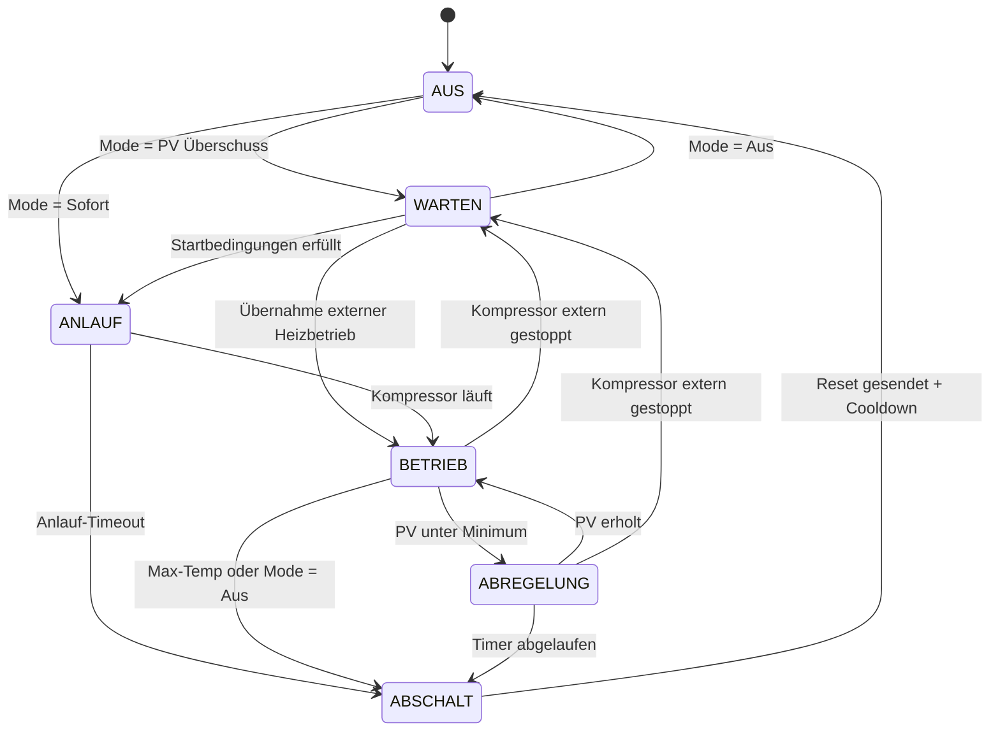

# PV Wärmepumpen Steuerung

Diese Home-Assistant-App steuert eine **Alpha Innotec Wärmepumpe** (Luxtronik 2.1) über **Modbus TCP** zur Optimierung des PV-Eigenverbrauchs. Bei Solarüberschuss wird der Kombispeicher über den Heizbetrieb geladen – vollautomatisch, mit Sicherheitsgrenzen und Schaltspielschutz.

Dank MQTT-Discovery werden alle Sensoren und Steuerelemente in Home Assistant automatisch als Gerät angelegt – kein manuelles YAML nötig.

> **Vorgaben und Grenzen** nennt diese Doku nicht. Die Vorgaben der App-Optionen stehen in [`config.yaml`](config.yaml) unter `options:`, die Startwerte der Dashboard-Parameter in `DEFAULT_PARAMS` in [`src/config.py`](src/config.py), die Bereiche der Regler in [`src/mqtt_handler.py`](src/mqtt_handler.py) und die festen Werte als Konstanten am Anfang der jeweiligen Datei in `src/`.

---

## ⚠️ Haftungsausschluss

Diese Software steuert eine Wärmepumpe über Modbus TCP. Unsachgemässe Konfiguration kann zu Schäden an der Anlage führen. Die Nutzung erfolgt auf eigene Verantwortung. Der Autor übernimmt keinerlei Haftung für Schäden, die durch die Nutzung dieser Software entstehen. Vor der Inbetriebnahme sind die Sicherheitseinstellungen der Wärmepumpe (Hochdruck, Übertemperatur, Schaltspielschutz, usw.) zu prüfen.

---

## 🌟 Features

- **Vollautomatische PV-Überschusssteuerung:** Startet die WP bei Solarüberschuss und stoppt bei Bewölkung mit einstellbarer Verzögerung
- **Leistungssteuerung:** Das Soft Limit wird dem PV-Überschuss nachgeführt
- **Kompressor-Überwachung:** Erkennt externe Starts und Stopps (Warmwasser, Abtauen, EVU-Sperre)
- **Übernahme-Logik:** Übernimmt einen laufenden Heizbetrieb, wenn genug PV vorhanden ist
- **Sicherheitsmechanismen:** NOTAUS bei Übertemperatur, Schaltspielschutz, Register-Refresh gegen den Modbus-Timeout
- **Drei Betriebsmodi:** Aus, PV Überschuss, Sofort
- **Parameter live anpassbar:** Über das HA-Dashboard ohne Neustart
- **Eigener Container:** Die Regelung läuft in der App, nicht in HA Core

---

## 📐 Systemarchitektur

Die App läuft als eigener Container in Home Assistant OS und kommuniziert über drei Kanäle:

| Kanal | Richtung | Zweck |
|---|---|---|
| **HA REST API** | App ← HA | PV-Überschuss und Batterie-SOC lesen |
| **MQTT** | App ↔ HA | Entitäten publizieren, Parameter empfangen |
| **Modbus TCP** | App ↔ WP | Register lesen und schreiben |

### Komponenten

| Komponente | Aufgabe |
|---|---|
| main.py | Hauptschleife, Orchestrierung, Timing |
| state_machine.py | Zustandsmaschine (Kernlogik) |
| modbus_client.py | Modbus TCP lesen und schreiben |
| mqtt_handler.py | MQTT-Discovery, Publish, Subscribe |
| ha_client.py | HA REST API (PV-Überschuss, SOC) |
| safety.py | Sicherheitslogik (NOTAUS) |
| param_store.py | Dashboard-Parameter in `/data/params.json` |
| config.py | App-Optionen, Startwerte, Version |
| logger.py | Logging |

### Datenfluss

1. **Je Messintervall** (`measurement_interval_s`): PV-Überschuss aus HA lesen, Modbus-Register lesen, Zustandsmaschine auswerten, Status per MQTT publizieren
2. **Je Schreibintervall** (`modbus_refresh_s`): Modbus-Register schreiben (Fixwert und Limit), damit sie nicht durch den Register-Timeout der WP verfallen

---

## 🔄 Funktionsweise

### Grundprinzip

Die Steuerung nutzt das **Smart Home Interface (SHI)** der Luxtronik 2.1 über Modbus TCP:

1. **Fixwert-Modus (HR10000=1):** Der Rücklauf-Sollwert wird direkt vorgegeben
2. **Soft Limit (HR10040=1):** Die elektrische Leistungsaufnahme wird begrenzt
3. **Register-Refresh:** Die Register werden je Schreibintervall neu geschrieben (siehe [Herstellervorgaben](#herstellervorgaben))

### Fixwert-Berechnung

| Phase | Fixwert | Zweck |
|---|---|---|
| **ANLAUF** | `max_temperature`, ohne Soft Limit | Grosses Delta für sicheren Kompressorstart |
| **BETRIEB** | min(RL_extern + `offset`, `max_temperature`) | Dynamisch nachgeführt |

### Limit-Berechnung (BETRIEB und ABREGELUNG)

Aktives Limit = max(PV-Überschuss, `min_power`)

Beispiel mit `min_power` = 1000 W:

| PV-Überschuss | Ergebnis |
|---|---|
| 1500 W | Limit = 1500 W |
| 700 W | Limit = 1000 W (Minimum greift) |

Im Modus **Sofort** gilt stattdessen `SOFORT_LIMIT_W` (praktisch unbegrenzt).

---

## 🔀 Zustandsmaschine

Das Herzstück der Steuerung ist eine Zustandsmaschine mit 6 Zuständen:

```mermaid
stateDiagram-v2
    [*] --> AUS
    AUS --> WARTEN : Mode = PV Überschuss
    AUS --> ANLAUF : Mode = Sofort
    WARTEN --> ANLAUF : Startbedingungen erfüllt
    WARTEN --> BETRIEB : Übernahme externer Heizbetrieb
    WARTEN --> AUS : Mode = Aus
    ANLAUF --> BETRIEB : Kompressor läuft
    ANLAUF --> ABSCHALT : Anlauf-Timeout
    BETRIEB --> ABREGELUNG : PV unter Minimum
    BETRIEB --> ABSCHALT : Max-Temp oder Mode = Aus
    BETRIEB --> WARTEN : Kompressor extern gestoppt
    ABREGELUNG --> BETRIEB : PV erholt
    ABREGELUNG --> ABSCHALT : Timer abgelaufen
    ABREGELUNG --> WARTEN : Kompressor extern gestoppt
    ABSCHALT --> AUS : Reset gesendet + Cooldown
```

Nach dem Start der App steht die Zustandsmaschine in **AUS**. Solange die Sicherheitssperre aktiv ist, bleibt sie dort, auch im Modus «PV Überschuss»; sie wechselt erst nach der Freigabe zu WARTEN.

### Zustände im Detail

| Zustand | Beschreibung | Modbus-Aktion |
|---|---|---|
| **AUS** | Steuerung inaktiv, nur Monitoring | Nur lesen (je Messintervall) |
| **WARTEN** | Modus aktiv, Startbedingungen werden geprüft | Nur lesen (je Messintervall) |
| **ANLAUF** | Fixwert = `max_temperature`, warte auf Kompressorstart | Schreiben: Fixwert ohne Limit (je Schreibintervall) |
| **BETRIEB** | Kompressor läuft, Fixwert und Limit aktiv | Schreiben: Fixwert und Limit (je Schreibintervall) |
| **ABREGELUNG** | PV zu tief, Timer läuft, Limit = `min_power` | Schreiben: Fixwert und Limit (je Schreibintervall) |
| **ABSCHALT** | Reset senden, Cooldown starten | Schreiben: Reset (einmalig) |

### Startbedingungen (WARTEN → ANLAUF)

Alle folgenden Bedingungen müssen gleichzeitig erfüllt sein:

| # | Bedingung | Prüfung |
|---|---|---|
| 1 | PV-Überschuss ausreichend | pv_surplus >= `min_surplus` |
| 2 | PV-Überschuss stabil | PV >= `min_surplus` seit `min_start_duration` |
| 3 | Batterie-SOC ausreichend | battery_soc >= `min_battery_soc` (0 = deaktiviert) |
| 4 | Schaltspielsperre abgelaufen | Cooldown = 0 |
| 5 | Speicher nicht voll | rl_extern < `max_temperature` |
| 6 | Genug Spielraum | `max_temperature` − rl_extern >= `offset` |
| 7 | Kompressor frei | Nicht extern belegt (WW, Abtauen) |
| 8 | Keine EVU-Sperre / Abtauen | Betriebsart ≠ 3 und ≠ 4 |
| 9 | Modbus verbunden | Verbindung steht |

Ist Bedingung 6 nicht erfüllt – der Speicher liegt weniger als `offset` unter `max_temperature` –, wird **nicht gestartet** und «Zu wenig Spielraum» geloggt.

### Zustandsübergänge

| Von | Nach | Bedingung | Aktion |
|---|---|---|---|
| AUS | WARTEN | Modus = «PV Überschuss» | – |
| AUS | ANLAUF | Modus = «Sofort», Cooldown = 0, RL_ext < `max_temperature` | – |
| WARTEN | ANLAUF | Alle Startbedingungen erfüllt | Timer starten |
| WARTEN | BETRIEB | WP heizt extern und unser Limit >= Leistung | Übernahme |
| ANLAUF | BETRIEB | Leistung über `KOMPRESSOR_LAEUFT_KW` | Kompressor läuft |
| ANLAUF | ABSCHALT | `startup_no_limit_s` ohne Kompressorstart | Fehler loggen |
| BETRIEB | ABREGELUNG | PV < `min_surplus` | Abschalt-Timer starten |
| BETRIEB | ABSCHALT | RL_ext >= `max_temperature` oder Modus = «Aus» | – |
| ABREGELUNG | BETRIEB | PV >= `min_surplus` in `PV_ERHOLT_ZYKLEN` Messzyklen in Folge | Timer zurücksetzen |
| ABREGELUNG | ABSCHALT | `shutdown_delay` abgelaufen | – |
| BETRIEB/ABREGELUNG | WARTEN | Kompressor extern gestoppt | Reset, Cooldown starten |
| Jeder aktive | ABSCHALT | Sicherheitsverletzung | Sofort |

---

## 🛡️ Sicherheitsmechanismen

| Schutz | Bedingung | Aktion | Einstellung |
|---|---|---|---|
| **NOTAUS** | RL extern >= `max_absolute_temperature` bei aktiver Steuerung | CRITICAL, sofort ABSCHALT | App-Option `max_absolute_temperature` |
| **Überhitzungs-Sperre** | RL extern >= `max_absolute_temperature` ohne aktive Steuerung | WARNING, kein Start möglich; Freigabe erst `SICHERHEITS_HYSTERESE_K` unter der Grenze | App-Option `max_absolute_temperature` |
| **Max. Temperatur** | RL_extern >= `max_temperature` | ABSCHALT | Dashboard-Regler |
| **Schaltspielschutz** | Cooldown aktiv | Kein Start möglich | `min_standzeit`, `wp_min_standzeit_min` |
| **Progressiver Cooldown** | Nach Fehlstart(s) | Cooldown wächst je Fehlstart, höchstens bis `MAX_COOLDOWN_FAKTOR` | Automatisch |
| **EVU-Sperre / Abtauen** | Betriebsart = 3 oder 4 | Kein Start möglich | Automatisch |
| **Start-Hysterese** | PV muss `min_start_duration` stabil über der Schwelle sein | Kein Start bei Spitzen | Dashboard-Regler |
| **Min. Batteriestand** | SOC unter Schwelle | Kein Start | Dashboard-Regler |
| **Anlauf-Timeout** | `startup_no_limit_s` ohne Kompressorstart | ABSCHALT, ERROR-Log | App-Option |
| **Reset-Verifizierung** | Kompressor läuft `RESET_PRUEFUNG_S` nach dem Reset noch | WARNING-Log | Automatisch |
| **Register-Refresh** | Register je Schreibintervall neu geschrieben | Werte verfallen nicht durch den Register-Timeout der WP | `modbus_refresh_s` |
| **Modbus-Unterbruch** | Verbindung verloren | Neuer Versuch nach `modbus_retry_delay_s` | App-Option |
| **HA-Unterbruch** | Kein PV-Wert von HA | Letzter Wert wird weiterverwendet; nach `ha_connection_timeout_min` gilt HA als getrennt, eine Abschaltung löst das derzeit **nicht** aus | App-Option |
| **Delta-Prüfung** | `max_temperature` − RL_ext < `offset` | Kein Start | Automatisch |

### Schaltspielschutz

Cooldown = max(`wp_min_standzeit_min`, `min_standzeit`) × Multiplikator

- `wp_min_standzeit_min`: technische Untergrenze (App-Option)
- `min_standzeit`: Einstellung im Dashboard (Regler)
- Multiplikator: Anzahl Fehlstarts + 1, höchstens `MAX_COOLDOWN_FAKTOR`

Die technische Untergrenze lässt sich über den Regler **nie unterschreiten**. Nach einem erfolgreichen Start fällt der Multiplikator auf 1 zurück.

---

## 🔍 Kompressor-Überwachung

Die App überwacht laufend den tatsächlichen Zustand des Kompressors (läuft, wenn die Leistung über `KOMPRESSOR_LAEUFT_KW` liegt) und reagiert auf externe Ereignisse.

### Externer Stopp (während BETRIEB/ABREGELUNG)

| Mögliche Ursache | Reaktion |
|---|---|
| RL-Begrenzung der Luxtronik (siehe [Herstellervorgaben](#herstellervorgaben)) | → **Reset**, WARTEN, Cooldown |
| Warmwasser-Anforderung beendet | → **Reset**, WARTEN, Cooldown |
| EVU-Sperre | → **Reset**, WARTEN, Cooldown |
| Hochdruckstörung | → **Reset**, WARTEN, Cooldown |

**Wichtig:** Bei jedem Verlassen des aktiven Zustands (ANLAUF/BETRIEB/ABREGELUNG) werden die Modbus-Register **immer** zurückgesetzt – unabhängig vom Grund. Nach dem Reset wird geprüft, ob der Kompressor innerhalb von `RESET_PRUEFUNG_S` stoppt (WARNING, falls nicht).

### Externer Start (während WARTEN)

| WP-Modus | Unser PV | Reaktion |
|---|---|---|
| Warmwasser (Betriebsart = 1) | egal | WARTEN (nicht stören) |
| Heizen, unser Limit >= Leistung | genug PV | ÜBERNEHMEN → direkt BETRIEB |
| Heizen, unser Limit < Leistung | zu wenig PV | WARTEN (würden drosseln) |
| Abtauen / EVU-Sperre | egal | WARTEN |

### Externe Übersteuerung (während BETRIEB)

| Ereignis | Log-Level | Aktion |
|---|---|---|
| WP wechselt auf Warmwasser | WARNING | Beobachten, weiter steuern |
| WP wechselt auf Abtauen oder EVU-Sperre | WARNING | Beobachten |
| WP kehrt zum Heizen zurück | INFO | Normal weiter steuern |
| Kompressor stoppt | WARNING | → WARTEN, Cooldown |

---

## 🎛️ Betriebsmodi

| Modus | Verhalten | Anwendungsfall |
|---|---|---|
| **Aus** | Steuerung inaktiv. Kein Modbus-Schreiben, nur Monitoring. | Normaler WP-Betrieb ohne PV |
| **PV Überschuss** | Vollautomatisch: Start bei PV, Stopp nach Verzögerung. | Standard-PV-Betrieb |
| **Sofort** | WP sofort starten, Limit `SOFORT_LIMIT_W`. `max_temperature` gilt weiterhin. | Manueller Test, schnell laden |

---

## ⚙️ Konfiguration

### App-Optionen (selten geändert)

Einzustellen in Home Assistant unter **Einstellungen → Apps → PV Wärmepumpen Steuerung → Konfiguration**. Die Vorgaben stehen in [`config.yaml`](config.yaml) unter `options:`. Fehlt eine Pflichtoption, startet die App nicht und nennt die fehlende Option im Log.

| Bezeichnung | Option | Typ | Beschreibung |
|---|---|---|---|
| MQTT Broker Adresse | `mqtt_host` | String | IP oder Hostname des MQTT-Brokers |
| MQTT Port | `mqtt_port` | Integer | Port des MQTT-Brokers |
| MQTT Benutzername | `mqtt_user` | String, optional | Benutzername für die MQTT-Anmeldung (leer = ohne Anmeldung) |
| MQTT Passwort | `mqtt_password` | Passwort, optional | Passwort für die MQTT-Anmeldung |
| Wärmepumpe IP-Adresse | `wp_ip` | String, **Pflicht ohne Vorgabe** | IP-Adresse der Luxtronik-Steuerung |
| Wärmepumpe Modbus Port | `wp_port` | Integer | Modbus-TCP-Port |
| Modbus Slave ID | `wp_slave_id` | Integer | Slave ID der Wärmepumpe |
| PV-Überschuss Entity | `ha_entity_pv_surplus` | String | HA-Entity-ID, die den PV-Überschuss in Watt liefert |
| Batterie SOC Entity | `ha_entity_battery_soc` | String | HA-Entity-ID für den Batterie-Ladestand in % (leer = deaktiviert) |
| Modbus Schreibintervall | `modbus_refresh_s` | Integer | Wie oft Register geschrieben werden (s) |
| Messintervall | `measurement_interval_s` | Integer | Wie oft Sensoren gelesen werden (s) |
| Anlauf-Timeout | `startup_no_limit_s` | Integer | Max. Wartezeit auf den Kompressorstart (s) |
| Technische Mindest-Standzeit | `wp_min_standzeit_min` | Integer | Minimale Pause zwischen Kompressorstarts (min) |
| Modbus Retry Verzögerung | `modbus_retry_delay_s` | Integer | Wartezeit vor erneutem Verbindungsversuch (s) |
| HA Verbindungs-Timeout | `ha_connection_timeout_min` | Integer | Dauer ohne HA-Daten, nach der HA als getrennt gilt (min) |
| NOTAUS Temperatur | `max_absolute_temperature` | Float | Absolute Maximaltemperatur für die Notabschaltung (°C) |
| MQTT Topic Prefix | `mqtt_topic_prefix` | String | Prefix für alle MQTT-Topics |
| MQTT Discovery Prefix | `mqtt_discovery_prefix` | String | Prefix für die HA-Discovery |
| Log-Level | `log_level` | Auswahl | Detailgrad der Protokollierung |

### Dashboard-Parameter (live anpassbar)

Bereich und Schrittweite der Regler legt die Discovery in [`src/mqtt_handler.py`](src/mqtt_handler.py) fest, die Startwerte stehen in `DEFAULT_PARAMS` in [`src/config.py`](src/config.py).

| Parameter | Einheit | Beschreibung |
|---|---|---|
| **Betriebsmodus** | – | Hauptschalter: Aus / PV Überschuss / Sofort |
| **Offset** | K | Aufschlag auf RL extern |
| **Min. PV Überschuss** | W | Startschwelle |
| **Min. Überschuss-Dauer** | min | So lange muss PV stabil über der Schwelle sein |
| **Min. Batteriestand** | % | Batterie-SOC, unter dem nicht gestartet wird (0 = deaktiviert) |
| **Ausschaltverzögerung** | min | Wartezeit bei PV-Mangel |
| **Min. Standzeit** | min | Pause zwischen Einschaltungen |
| **Max. Speichertemperatur** | °C | Obere Grenze |
| **Min. Leistung** | W | Untere Limit-Grenze |

#### Parameter-Persistenz

Einstellungen aus dem Dashboard werden in `/data/params.json` gespeichert – je Parameter der zuletzt gesetzte Wert, mit denselben Schlüsseln wie `DEFAULT_PARAMS`. Sie überleben:
- Neustarts der App
- Neubau und Updates
- Neustarts von HA

Die Datei geht nur verloren, wenn die App mit «Daten löschen» deinstalliert wird. Bei der Erstinstallation gelten die Startwerte aus `DEFAULT_PARAMS`.

---

## 📊 Entitäten (automatisch per MQTT-Discovery)

### Sensoren

| Entität | Einheit | Beschreibung |
|---|---|---|
| Zustand | – | AUS, WARTEN, ANLAUF, BETRIEB, ABREGELUNG, ABSCHALT |
| Leistungsaufnahme | W | Elektrische Aufnahme des Kompressors |
| Heizleistung | W | Thermische Leistung |
| COP | – | Coefficient of Performance |
| Speichertemperatur | °C | RL extern (Kombispeicher-Fühler) |
| Sollwert | °C | An die WP gesendeter Fixwert |
| PV Überschuss | W | Von HA gelesener PV-Überschuss |
| Aktives Limit | W | Gesetztes Soft Limit |
| Laufzeit | min | Zeit seit Anlauf |
| Standzeit | min | Verbleibende Schaltspielsperre |
| Abschalt-Timer | min | Verbleibende Ausschaltverzögerung |
| Energie heute | kWh | Heutige Energie (Reset um Mitternacht) |
| Batteriestand | % | Batterie-SOC (wenn konfiguriert) |

### Binärsensoren

| Entität | Beschreibung |
|---|---|
| WP Kompressor | ON = Leistung über `KOMPRESSOR_LAEUFT_KW` |
| Modbus Verbindung | ON = Modbus TCP verbunden |

### Steuerelemente

| Entität | Typ | Beschreibung |
|---|---|---|
| Betriebsmodus | Select | Aus / PV Überschuss / Sofort |
| Offset | Number (Regler) | Temperatur-Offset in Kelvin |
| Min. PV Überschuss | Number (Regler) | Startschwelle in Watt |
| Ausschaltverzögerung | Number (Regler) | Timer in Minuten |
| Min. Standzeit | Number (Regler) | Cooldown in Minuten |
| Max. Speichertemperatur | Number (Regler) | Obere Grenze in °C |
| Min. Leistung | Number (Regler) | Untere Limit-Grenze in Watt |
| Min. Überschuss-Dauer | Number (Regler) | PV-Stabilisierungszeit in Minuten |
| Min. Batteriestand | Number (Regler) | Min. Batterie-SOC in % (0 = deaktiviert) |

---

## 📡 Modbus-Register

### Geschriebene Register (Holding Registers)

| Register | Wert | Zweck |
|---|---|---|
| HR10065 | 0 | Overall Mode: Individuell |
| HR10000 | 1 | Modus Heizen: Fixwert |
| HR10001 | Fixwert × 10 | Rücklauf-Sollwert (z. B. 500 = 50,0 °C) |
| HR10040 | 0 / 1 | LPC-Modus: aus (ANLAUF) / Soft Limit (BETRIEB, ABREGELUNG) |
| HR10041 | Limit / 100 | PC Limit (z. B. 12 = 1200 W) |

Beim Reset schreibt die App alle fünf Register auf ihre Grundstellung zurück (`write_reset()` in [`src/modbus_client.py`](src/modbus_client.py)).

### Gelesene Register (Input Registers)

| Register | Wert | Zweck |
|---|---|---|
| IR10102 | °C × 10 | RL extern (Speicherfühler) |
| IR10101 | °C × 10 | RL SOLL (aktuell gültig) |
| IR10100 | °C × 10 | RL IST |
| IR10105 | °C × 10 | Vorlauf IST |
| IR10301 | kW × 10 | Leistungsaufnahme |
| IR10300 | kW × 10 | Heizleistung |
| IR10002 | Code | Betriebsart (0 = Heizen, 1 = WW, 3 = EVU-Sperre, 4 = Abtauen, 5 = keine) |
| IR10000 | Bitfeld | WP-Status (Bit 0 = Kompressor) |
| IR10201 | Fehlernummer | 0 = kein Fehler, sonst Fehlernummer |
| IR10203 | Minuten | Verbleibende Schaltspielsperre bis zur nächsten Einschaltung |
| IR10302 | kW × 10 | Minimal prognostizierte elektrische Leistung |

### Betriebsparameter und Hinweise

Die folgenden Angaben beruhen auf Herstellerangaben sowie eigenen Erkenntnissen aus der Integration.

#### Herstellervorgaben

| Thema | Detail | Quelle |
|---|---|---|
| Anlaufleistung und Soft Limit | Der Verdichter startet nicht, wenn die benötigte Anlaufleistung über dem eingestellten Soft Limit (HR10041) liegt. **Abhilfe:** Entweder HR10041 höher setzen, um die Anlaufleistung abzudecken, oder erst starten und das Limit anschliessend nachsetzen. Die App schaltet deshalb im ANLAUF das Soft Limit ab. | Hersteller (Mail) |
| Rücklauf-/Vorlaufbegrenzung | Konfigurierbar über Bedienteil: *Service → Einstellungen → Temperaturen* (Installateurzugang erforderlich). Werkseinstellung: 50 °C. Erhöhung auf 55–60 °C vom Hersteller freigegeben. Max. Vorlauf ca. 70 °C (wird je nach Bedingungen dynamisch nach unten angepasst). Max. Rücklauf liegt ca. 4–8 °C unter dem Vorlauf. ⚠️ Höhere Temperaturen bedeuten höhere Belastung der WP. | Hersteller (Mail) |
| Mindestleistung Kompressor | Die minimale Leistung ist abhängig von Wärmequelle und Vorlauftemperatur. Siehe Leistungskurve Pe min/max in der Bedienungsanleitung. | Bedienungsanleitung, Anhang S. 21 |
| Register-Timeout (15 min) | Der Modbus-Client setzt alle empfangenen Daten nach 15 min ohne jegliche Anfrage vom Master auf Standardeinstellung zurück. **Wichtig:** Jede Anfrage (auch Lesezugriffe) setzt den Timer zurück – solange das System Register liest, bleiben geschriebene Werte erhalten. | Betriebsanleitung SHI Modbus TCP, Kap. 3 |

#### Erkenntnisse aus der Integration

| Thema | Detail |
|---|---|
| Schreibpausen | Zwischen Registerschreibvorgängen mindestens 1 Sekunde warten |
| Startdelta (Workaround) | Für einen zuverlässigen Kompressorstart hat sich in der Praxis ein Delta von ca. 10 K (SOLL − RL_ext) bewährt. Das ist keine Herstellervorgabe, sondern ein Erfahrungswert. |
| Öl-Vorwärmung | Der Kompressor startet erst nach der Öl-Vorwärmung (~100 W, periodisch alle 25–30 min). Nach langer Standzeit kann der Start bis zu 150 s dauern. `startup_no_limit_s` muss das abdecken. |

---

## ⏱️ Timing

| Aktion | Takt |
|---|---|
| Modbus lesen | `measurement_interval_s` |
| PV-Überschuss und SOC lesen | `measurement_interval_s` |
| Zustandsmaschine auswerten | `measurement_interval_s` |
| MQTT-Status publizieren | `measurement_interval_s` |
| Modbus schreiben (Refresh) | `modbus_refresh_s` |
| Energiezähler zurücksetzen | Mitternacht |

---

## 🛠️ Voraussetzungen

1. **Wärmepumpe:** Alpha Innotec mit Luxtronik 2.1 (Software V3.89+)
2. **Modbus TCP:** Am Regler aktiviert
3. **Smart Grid:** Am Regler auf **«Nein»** gestellt
4. **Heizgrenze:** Am Regler **deaktiviert** (damit auch im Sommer gestartet werden kann)
5. **Netzwerk:** WP und HA im gleichen LAN
6. **MQTT:** Mosquitto-Broker (z. B. die Mosquitto-App) eingerichtet
7. **PV-Sensor:** Eine HA-Entität, die den PV-Überschuss in Watt liefert
8. **Batterie-Sensor (optional):** Eine HA-Entität, die den Batterie-SOC in % liefert

---

## 📦 Installation

1. In Home Assistant zu **Einstellungen → Apps** navigieren
2. **App-Store** öffnen
3. Oben rechts über die drei Punkte **Repositories** öffnen
4. Repository-URL hinzufügen: `https://github.com/tsgwiro1/rwi_ha_apps`
5. Fenster schliessen und die Seite neu laden
6. **«PV Wärmepumpen Steuerung»** suchen und **Installieren**
7. Reiter **Konfiguration**: mindestens `wp_ip` setzen, dazu den MQTT-Zugang
8. **«Beim Booten starten»** und **«Watchdog»** aktivieren
9. **Starten**
10. **Log** prüfen – nach dem Start erscheinen die Entitäten automatisch

---

## 🐞 Fehlerbehebung

### Log-Level

| Level | Ausgabe | Anwendungsfall |
|---|---|---|
| error | Nur Fehler und kritische Ereignisse | Produktiv (minimal) |
| warning | + Warnungen (externe Stopps, Sicherheit) | Produktiv |
| info | + Zustandswechsel, Start/Stopp, Zyklus-Zusammenfassung | Normalbetrieb |
| debug | + wiederholte Wartegründe, Wechsel BETRIEB↔ABREGELUNG, Fixwert/Limit, Modbus-Verify, Messzyklen | Nur zur Fehlersuche |

### Häufige Probleme

| Problem | Log-Meldung | Lösung |
|---|---|---|
| App startet nicht | App-Option fehlt: … | Genannte Option in der Konfiguration setzen |
| WP startet nicht | ANLAUF FEHLGESCHLAGEN nach … s | WP-interne Sperre abwarten, Störung prüfen |
| SOLL nicht übernommen | SOLL nicht übernommen! | Modbus-Verbindung prüfen |
| SOLL gedeckelt | Modbus write verify: SOLL tiefer als erwartet (debug) | RL-Begrenzung der Luxtronik prüfen |
| MQTT rc=5 | Verbindung fehlgeschlagen (rc=5) | Benutzer/Passwort prüfen |
| Kompressor extern gestoppt | Kompressor extern gestoppt! | Normal, der Cooldown läuft |
| Kein Start wegen Delta | Zu wenig Spielraum | Speicher warm, warten |
| Überhitzungs-Sperre | SAFETY: RL extern … >= … | Warten, bis RL extern `SICHERHEITS_HYSTERESE_K` unter `max_absolute_temperature` liegt |
| EVU-Sperre blockiert Start | EVU-Sperre aktiv | Normal, auf Freigabe warten (erfahrungsgemäss ~60–90 min) |
| Mehrere Fehlstarts | ANLAUF FEHLGESCHLAGEN, Fehlstarts=… | WP-interne Sperre, der Cooldown verlängert sich automatisch |

---

## 📡 MQTT-Topics (Referenz)

`pvwp` steht für die Option `mqtt_topic_prefix`.

### Status (App → HA)

| Topic | Beispiel | Beschreibung |
|---|---|---|
| pvwp/state | BETRIEB | Zustand |
| pvwp/power_consumption | 850 | Leistungsaufnahme (W) |
| pvwp/heat_output | 4200 | Heizleistung (W) |
| pvwp/cop | 4.9 | COP |
| pvwp/rl_extern | 42.3 | Speichertemperatur (°C) |
| pvwp/rl_soll | 47.3 | Sollwert (°C) |
| pvwp/pv_surplus | 1350 | PV-Überschuss (W) |
| pvwp/active_limit | 1200 | Limit (W) |
| pvwp/runtime | 45 | Laufzeit (min) |
| pvwp/cooldown | 0 | Standzeit (min) |
| pvwp/abregelung_timer | 12 | Abschalt-Timer (min) |
| pvwp/wp_running | ON/OFF | Kompressor |
| pvwp/modbus_connected | ON/OFF | Modbus |
| pvwp/energy_today | 2.4 | Energie (kWh) |
| pvwp/battery_soc | 85 | Batteriestand (%) |
| pvwp/availability | online/offline | Last Will |

### Steuerung (HA → App)

| Topic | Wert | Beschreibung |
|---|---|---|
| pvwp/set/mode | Aus / PV Überschuss / Sofort | Modus |
| pvwp/set/offset | Zahl (K) | Offset |
| pvwp/set/min_surplus | Ganzzahl (W) | Min. Überschuss |
| pvwp/set/shutdown_delay | Ganzzahl (min) | Ausschaltverzögerung |
| pvwp/set/min_standzeit | Ganzzahl (min) | Min. Standzeit |
| pvwp/set/max_temperature | Zahl (°C) | Max. Speichertemperatur |
| pvwp/set/min_power | Ganzzahl (W) | Min. Leistung |
| pvwp/set/min_start_duration | Ganzzahl (min) | Min. Überschuss-Dauer |
| pvwp/set/min_battery_soc | Ganzzahl (%) | Min. Batteriestand |

Die App bestätigt jeden übernommenen Wert auf `pvwp/<parameter>`.

---

## 📂 Projektstruktur

| Datei | Zweck |
|---|---|
| config.yaml | App-Metadaten, Optionen-Schema und Vorgaben |
| Dockerfile | Container-Build |
| run.sh | Startskript (die Optionen liest das Programm selbst) |
| dashboard.yaml | Beispiel-View für das HA-Dashboard |
| src/main.py | Hauptschleife und Orchestrierung |
| src/config.py | App-Optionen, `DEFAULT_PARAMS`, Version |
| src/state_machine.py | Zustandsmaschine |
| src/modbus_client.py | Modbus TCP |
| src/mqtt_handler.py | MQTT-Discovery, Publish, Subscribe |
| src/ha_client.py | HA REST API |
| src/safety.py | Sicherheitslogik |
| src/param_store.py | Persistente Parameter (`/data/params.json`) |
| src/logger.py | Logging |
| translations/de.yaml | Deutsche Bezeichnungen der App-Optionen |
| translations/en.yaml | Englische Bezeichnungen der App-Optionen |
| CHANGELOG.md | Änderungen je Version |
| OFFENE-PUNKTE.md | Posteingang der App |

---

## 📄 Lizenz

Dieses Projekt steht unter der MIT-Lizenz. Siehe [LICENSE](../LICENSE).
